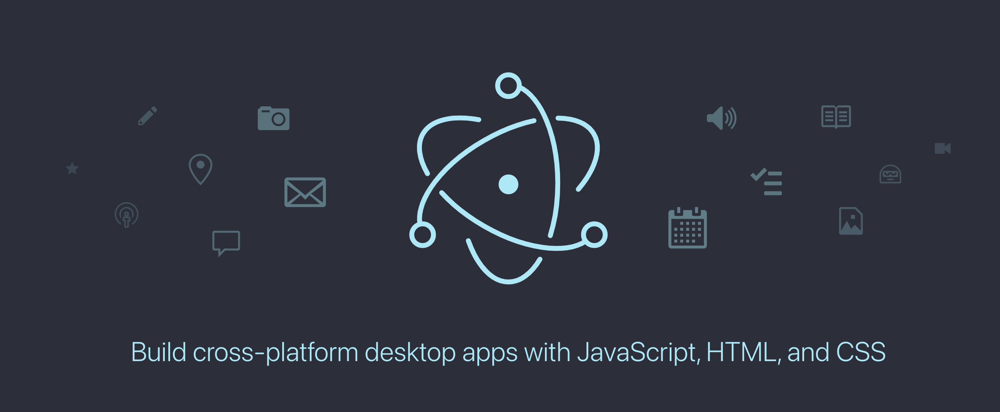
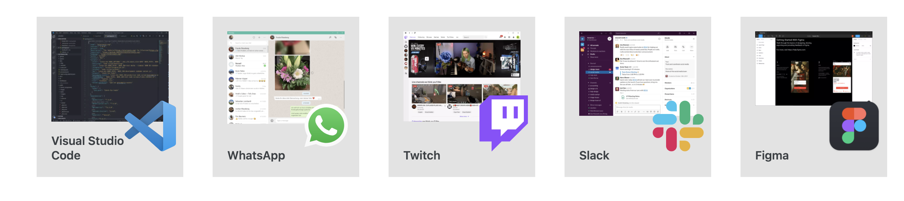
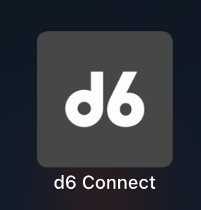

# Your first Desktop App using Electron



## Greetings

So today we are going to explore the world of particle physics, and we are going to talk about electrons, just kidding i know nothing about particle physics, not even sure if electrons and protons are a particle physics thingie 🤷🏾

The tech in question is is Electron, a javascript framework that uses web technologies to create cross platform desktop apps, well to be honest with you its not really a desktop app,  its like a running your website on a standalone Chrome "Chromium in this case".

There are quite a lot of advantages to having access to a chromium engine that also has full access to your computer, you can be able to access full system capabilities such as hardware camera, microphone, file system, battery status ... etc

# Who uses Electron?





## Requirements

- Basic Web Development (HTML,CSS,JavaScript)
- NodeJs ([https://nodejs.org/en/](https://nodejs.org/en/))
    - You can install the latest version of  NodeJs from the link above and follow them instructions.

# Let  the code speak

### Setup

Electron apps follow the same general structure as other Node.js projects. Start by creating a folder and initializing an npm package.

```bash
mkdir the-electron-app && cd the-electron-app
npm init
```

The interactive `init` command will prompt you to set some fields in your config. There are a few rules to follow for the purposes of this tutorial:

- `entry point` should be `main.js`.
- `author` and `description` can be any value, but are necessary for [app packaging](https://www.electronjs.org/docs/tutorial/quick-start#package-and-distribute-your-application).

Your `package.json` file should look something like this:

```json
{
  "name": "the-electron-app",
  "version": "1.0.0",
  "description": "The App!",
  "main": "main.js",
  "author": "Jakub Blaszcykowski",
  "license": "MIT"
}
```

Then, install the `electron` package into your app's `devDependencies`.

```bash
$ npm install --save-dev electron
```

> Note: If you're encountering any issues with installing Electron, please refer to the Advanced Installation guide.

Finally, you want to be able to execute Electron. In the `[scripts](https://docs.npmjs.com/cli/v7/using-npm/scripts)` field of your `package.json` config, add a `start` command like so:

```json
{
  "scripts": {
    "start": "electron ."
  }
}
```

This `start` command will let you open your app in development mode.

```bash
$ npm start
```

> Note: This script tells Electron to run on your project's root folder. At this stage, your app will immediately throw an error telling you that it cannot find an app to run.

The entry point of any Electron application is its `main` script. This script controls the **main process**.

During execution, Electron will look for this script in the [main](https://docs.npmjs.com/cli/v7/configuring-npm/package-json#main) field of the app's `package.json` config, which you should have configured during the [app scaffolding](https://www.electronjs.org/docs/tutorial/quick-start#scaffold-the-project) step.

To initialize the `main` script, create an empty file named `main.js` in the root folder of your project.

> Note: If you run the start script again at this point, your app will no longer throw any errors! However, it won't do anything yet because we haven't added any code into main.js.

## **Process Management**

### **Main process**
Runs in a full Node.js environment and is responsible for controlling your app's lifecycle, displaying native interfaces, performing privileged operations, and managing renderer processes

### **Renderer process**
Each Electron app spawns a separate renderer process for each open BrowserWindow (and each web embed). As its name implies, a renderer is responsible for rendering web content. For all intents and purposes, code ran in renderer processes should behave according to web standards (insofar as Chromium does, at least).

Therefore, all user interfaces and app functionality within a single browser window should be written with the same tools and paradigms that you use on the web.


## **Create a web page**

Before we can create a window for our application, we need to create the content that will be loaded into it. In Electron, each window displays web contents that can be loaded from either from a local HTML file or a remote URL.

For this tutorial, you will be doing the former. Create an `index.html` file in the root folder of your project:

```html
<!DOCTYPE html><html>
  <head>
    <meta charset="UTF-8">
    <!-- https://developer.mozilla.org/en-US/docs/Web/HTTP/CSP -->
    <meta http-equiv="Content-Security-Policy" content="default-src 'self'; script-src 'self'">
    <meta http-equiv="X-Content-Security-Policy" content="default-src 'self'; script-src 'self'">
    <title>Hello World!</title>
  </head>
  <body>
    <h1>Hello World!</h1>
    We are using Node.js <span id="node-version"></span>,
    Chromium <span id="chrome-version"></span>,
    and Electron <span id="electron-version"></span>.
  </body>
</html>
```

> Note: Looking at this HTML document, you can observe that the version numbers are missing from the body text. We'll manually insert them later using JavaScript.

### **Opening your web page in a browser window**

Now that you have a web page, load it into an application window. To do so, you'll need two Electron modules:

- The `[app](https://www.electronjs.org/docs/api/app)` module, which controls your application's event lifecycle.
- The `[BrowserWindow](https://www.electronjs.org/docs/api/browser-window)` module, which creates and manages application windows.

Because the main process runs Node.js, you can import these as [CommonJS](https://nodejs.org/docs/latest/api/modules.html#modules_modules_commonjs_modules) modules at the top of your file:

```jsx
const { app, BrowserWindow } = require('electron')
```

Then, add a `createWindow()` function that loads `index.html` into a new `BrowserWindow` instance.

```jsx
functioncreateWindow () {
	const win =new BrowserWindow({
    width: 800,
    height: 600
  })

  win.loadFile('index.html')
}
```

Next, call this `createWindow()` function to open your window.

In Electron, browser windows can only be created after the `app` module's `[ready](https://www.electronjs.org/docs/api/app#event-ready)` event is fired. You can wait for this event by using the `[app.whenReady()](https://www.electronjs.org/docs/api/app#appwhenready)` API. Call `createWindow()` after `whenReady()` resolves its Promise.

```jsx
app.whenReady().then(() => {
  createWindow()
})
```

> Note: At this point, your Electron application should successfully open a window that displays your web page!


## Manage your window's lifecycle
Although you can now open a browser window, you'll need some additional boilerplate code to make it feel more native to each platform. Application windows behave differently on each OS, and Electron puts the responsibility on developers to implement these conventions in their app.

In general, you can use the process global's platform attribute to run code specifically for certain operating systems.

Quit the app when all windows are closed (Windows & Linux)
On Windows and Linux, exiting all windows generally quits an application entirely.

To implement this, listen for the app module's 'window-all-closed' event, and call `app.quit()` if the user is not on `macOS (darwin)`.
```jsx
app.on('window-all-closed', function () {
  if (process.platform !== 'darwin') app.quit()
})
```

Open a window if none are open (macOS)
Whereas Linux and Windows apps quit when they have no windows open, macOS apps generally continue running even without any windows open, and activating the app when no windows are available should open a new one.

To implement this feature, listen for the app module's activate event, and call your existing `createWindow()` method if no browser windows are open.

Because windows cannot be created before the ready event, you should only listen for activate events after your app is initialized. Do this by attaching your event listener from within your existing whenReady() callback.
```jsx
app.whenReady().then(() => {
  createWindow()

  app.on('activate', function () {
    if (BrowserWindow.getAllWindows().length === 0) createWindow()
  })
})
```
>Note: At this point, your window controls should be fully functional!

## Access `Node.js` from the renderer with a preload script

Now, the last thing to do is print out the version numbers for Electron and its dependencies onto your web page.

Accessing this information is trivial to do in the main process through Node's global process object. However, you can't just edit the DOM from the main process because it has no access to the renderer's document context. They're in entirely different processes!

>Note: If you need a more in-depth look at Electron processes, see the Process Model document.

This is where attaching a preload script to your renderer comes in handy. A preload script runs before the renderer process is loaded, and has access to both renderer globals (e.g. window and document) and a Node.js environment.

Create a new script named preload.js as such:
```jsx
window.addEventListener('DOMContentLoaded', () => {
  const replaceText = (selector, text) => {
    const element = document.getElementById(selector)
    if (element) element.innerText = text
  }

  for (const dependency of ['chrome', 'node', 'electron']) {
    replaceText(`${dependency}-version`, process.versions[dependency])
  }
})
```

The above code accesses the `Node.js process.versions` object and runs a basic replaceText helper function to insert the version numbers into the HTML document.

To attach this script to your renderer process, pass in the path to your preload script to the webPreferences.preload option in your existing BrowserWindow constructor.

```jsx
// include the Node.js 'path' module at the top of your file
const path = require('path')

// modify your existing createWindow() function
function createWindow () {
  const win = new BrowserWindow({
    width: 800,
    height: 600,
    webPreferences: {
      preload: path.join(__dirname, 'preload.js')
    }
  })

  win.loadFile('index.html')
}
// ...
```

There are two Node.js concepts that are used here:

The `__dirname` string points to the path of the currently executing script (in this case, your project's root folder).
The `path.join` API joins multiple path segments together, creating a combined path string that works across all platforms.
We use a path relative to the currently executing JavaScript file so that your relative path will work in both development and packaged mode.

# Bonus

If you would like to play around with electron, checkout this cool thingie called  Electron Fiddle ([https://www.electronjs.org/fiddle](https://www.electronjs.org/fiddle))

### Update our html to be more nicer

for my case, i am going to use the [https://unitx.co.za](https://unitx.co.za) original codebase.

### Create and publish your app

Well  this is where  things get quite complicated, because there are various niggles that come into play.

**Install electron builder and  electron updater**

```shell
$ npm i -S electron-updater 
$ npm i -D electron-builder
```

once thats done, you will need to add the following into your `package.json` file

> Please update with  your own details accordingly

```jsx
...
"build": {
    "appId": "za.co.unitx",
    "productName": "UnitX",
    "directories": {
      "buildResources": "assets/icons"
    },
    "linux": {
      "target": {
        "target": "appimage",
        "arch": [
          "armv7l"
        ]
      }
    },
    "win": {
      "publisherName": "UnitX (Pty) Ltd",
      "icon": "assets/icons/icon.png"
    },
    "publish": [
      {
        "provider": "github",
        "repo": "unitx-desktop-app-releases"
      }
    ]
},
"author": {
  "name": "Jakub Blasczkykowski",
  "email": "keith@unitx.co.za"
},
...
```

We need to add the app icons at location `assets/icons`, we can do this by quickly running:

```shell
$ mkdir -p assets/icons
$ cp /location/of/icon_name.png assets/icons/icon.png
```

And then add the following line in your `scripts` section of the `package.json`

```json
"publish:win-linux": "electron-builder -wl -p always",
"publish:mac": "electron-builder -m -p always",
```

The `"-p always"` simply tells the electron builder to publish the build artifacts to github releases once its done creating the artifacts. for this to work you will need to make sure that you have your `GH_TOKEN=the-token-for-accessing-your-github-account` env is set

But worry not, if you only plan to deploy to Linux and Windows, then the Electron guys gots you, you can simply use their ready build docker-images which use Wine to create windows builds and the advantage of that is that its an `Ubuntu` container meaning you can  build  a linux build in parallel with windows

create a new file in your root project and call it `docker-compose.yml` and paste the snippet bellow
```yaml
version: '2'
services:
    unitx-builder:
        image: electronuserland/builder:wine
        container_name: unitx-builder
        volumes:
            - $PWD:/project
            - ~/.cache/electron:/root/.cache/electron
            - ~/.cache/electron-builder:/root/.cache/electron-builder
            # - ~/Desktop/certs/your-cool-cert.pfx:/.your-certs/your-cool-cert.pfx
        environment:
            - GH_TOKEN=40ab6bb3b73277a920c83564df5a213b69ea1ea6
            - ELECTRON_CACHE=/root/.cache/electron
            - ELECTRON_BUILDER_CACHE=/root/.cache/electron-builder
            # - CSC_LINK=/.your-certs/your-cool-cert.pfx
            # - CSC_KEY_PASSWORD=your-cool-cert-password
        command: npm run publish:publish:win-linux
```

and to build you can simply run
```shell
$ docker-compose up
```
now you can sit back and watch 

### For MacOS builds

we can simply run 

```shell
$ export CSC_IDENTITY_AUTO_DISCOVERY=false #disable auto code signing
$ export GH_TOKEN=40ab6bb3b73277a920c83564df5a213b69ea1ea6
$ npm run publish:mac
```


*The MacOs issue*

- To publish apps to the Mac app store, apps need to be signed and "notarized"
- MacOs builds can only be built on a ..... you guessed it a MacOs machine
- Getting code signing certificates is not a straightforward thing to do
- Push Notifications

*The Windows Issue*

- Push Notifications
- Creating a new build can sometimes fail due to permission errors for some archives being unable to zip or unzip some artifacts, so it can be frustrating to try and  solve a problem which you cannot fully reproduce

Luckily at the time of writing,  there have been new packages that solve most if not all of these outlined issues.

My favorite packages in the electron world

```jsx
"dependencies": {
		...
		"@bugsnag/js": "^7.10.5",
    "electron-context-menu": "^0.12.1",
    "electron-push-receiver": "^2.1.2",
    "electron-settings": "^3.2.0",
    "electron-updater": "^4.3.2",
    "lodash": "^4.17.20",
    "promise": "8.0.1",
    "winston": "^2.2.0"
		...
},
"devDependencies": {
		...
	  "electron-builder": "^22.9.1",
	  "electron-notarize": "^1.0.0",
		...
}
```

A  full guide on how to create and publish your app can be found on [https://www.electron.build/](https://www.electron.build/)